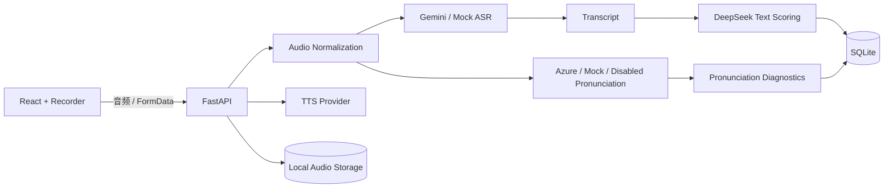

# AI Speaking Coach

## Azure Pronunciation Assessment（2026-06-30）

语音答案现在可在保留 Gemini ASR 和 DeepSeek 评分的同时，使用 Azure Speech 对原始录音进行发音评估。Azure 返回 0–100 原始分，页面同时显示明确标注为 estimated 的 IELTS 0–9 启发式分数；该分数不参与现有 Overall 计算。Azure 不可用时会降级为 N/A，不阻断转写和其他评分。

在 `backend/.env` 中配置并重启后端：

```dotenv
PRONUNCIATION_PROVIDER=azure
AZURE_SPEECH_KEY=your_azure_speech_key
AZURE_SPEECH_REGION=your_azure_speech_region
AZURE_SPEECH_LANGUAGE=en-US
AZURE_PRONUNCIATION_TIMEOUT_SECONDS=330
```

真实 Key 只能保存在未提交的 `backend/.env` 中。`PRONUNCIATION_PROVIDER` 还支持 `mock` 和 `disabled`。

AI Speaking Coach 是一个面向 IELTS Speaking（雅思口语）的语音练习全栈 MVP。应用支持考官语音、浏览器录音、可替换 ASR、DeepSeek 结构化评分，以及带录音回放的历史记录。

## 功能特性

- 支持 Targeted Part Practice 与 4/1/3 共 8 题的 Full Speaking Mock Test
- AI Examiner Agent 根据口语部分生成结构化考题
- Gemini TTS Provider 生成考官语音，Mock TTS 支持无 Key 本地开发
- 基于 `react-media-recorder` 录制用户回答，每道题最长可录制 5 分钟
- ASR Provider 将录音转为 transcript，支持 Gemini ASR 与 Mock ASR
- DeepSeek 提供流利度、词汇、语法、纠错、优化答案及下一步建议
- Azure Pronunciation Assessment 基于原始音频提供 PronScore、Accuracy、Fluency、Prosody 和低分单词
- 使用 SQLite 与本地音频目录持久化练习记录和录音
- 支持历史列表和练习详情查看
- 支持浅色、暗色和跟随系统三种页面主题
- 支持可收起侧栏和响应式页面布局

> `mock` Provider 用于无外部 Key 的本地开发；真实链路可配置 Gemini TTS、Gemini ASR 与 Azure Pronunciation。Azure 失败时发音维度降级为 N/A，Gemini 转写和 DeepSeek 文本评分仍继续执行。

## 技术栈

### 前端

- React 19
- TypeScript
- Vite 6
- Material UI 9
- Emotion
- react-media-recorder

### 后端

- Python
- FastAPI
- SQLAlchemy
- Pydantic Settings
- SQLite
- DeepSeek Chat API
- Gemini TTS / Mock TTS
- Gemini ASR / Mock ASR Provider
- Azure / Mock / Disabled Pronunciation Provider
- Azure Cognitive Services Speech SDK
- Alembic

## 系统架构



## 业务流程

1. 用户选择 IELTS Speaking Part 1、Part 2 或 Part 3。
2. Examiner Agent 生成题目，Gemini/Mock TTS 返回可播放考官音频。
3. 用户录音后，前端以 FormData 上传音频。
4. 后端将音频统一转换为 16 kHz、16-bit、单声道 PCM WAV。
5. ASR Provider 返回 transcript，DeepSeek 对文本进行结构化评分；Pronunciation Provider 独立评估原始语音表现。
6. 后端保存录音、transcript、文本反馈和发音诊断；Azure 不可用时只将发音维度降级为 N/A。
7. Full Mock 每题先转写评分，8 题完成后再生成一次全局报告。

## 项目结构

```text
ai-speaking-coach/
├─ backend/
│  ├─ app/
│  │  ├─ agents/          # Examiner 与 Feedback Agent
│  │  ├─ api/routes/      # FastAPI 路由
│  │  ├─ llm/             # DeepSeek Provider 与 JSON 解析
│  │  ├─ models/          # SQLAlchemy 模型
│  │  ├─ prompts/         # LLM Prompt
│  │  ├─ schemas/         # 请求与响应模型
│  │  └─ services/        # 练习记录服务
│  └─ requirements.txt
├─ frontend/
│  ├─ src/
│  │  ├─ api/             # 前端 API 客户端
│  │  ├─ components/      # 通用 UI 组件
│  │  ├─ pages/           # 业务页面
│  │  └─ theme.ts         # Material UI 主题
│  └─ package.json
└─ README.md
```

## 环境要求

- Python 3.10 或更高版本
- Node.js 20 或更高版本
- npm
- 可用的 DeepSeek API Key

## 本地运行

### 1. 启动后端

在项目根目录执行：

```powershell
cd backend
python -m venv .venv
.\.venv\Scripts\python.exe -m pip install -r requirements.txt
```

复制 `backend/.env.example` 为 `backend/.env`，至少配置 DeepSeek：

```dotenv
DEEPSEEK_API_KEY=your_api_key_here
DEEPSEEK_BASE_URL=https://api.deepseek.com
DEEPSEEK_MODEL=deepseek-chat
DATABASE_URL=sqlite:///./data/app.db
CORS_ORIGINS=http://127.0.0.1:5180,http://localhost:5180
TTS_PROVIDER=mock
ASR_PROVIDER=mock
GEMINI_ASR_MODEL=gemini-2.5-flash
PRONUNCIATION_PROVIDER=disabled
AZURE_SPEECH_KEY=
AZURE_SPEECH_REGION=
AZURE_SPEECH_LANGUAGE=en-US
AZURE_PRONUNCIATION_TIMEOUT_SECONDS=330
```

首次创建数据库：

```powershell
.\.venv\Scripts\python.exe -m alembic upgrade head
```

已有旧版数据库需先执行一次 `alembic stamp 0001_baseline`，再执行 `alembic upgrade head`。

启动 FastAPI：

```powershell
.\.venv\Scripts\python.exe -m uvicorn app.main:app --reload --host 127.0.0.1 --port 8010
```

健康检查地址：<http://127.0.0.1:8010/api/health>

### 2. 启动前端

另开一个终端，在项目根目录执行：

```powershell
cd frontend
npm install
npm run dev
```

浏览器访问：<http://127.0.0.1:5180>

Vite 会将前端的 `/api` 请求代理到 `http://127.0.0.1:8010`。

## API 接口

| 方法 | 路径 | 说明 |
| --- | --- | --- |
| GET | `/api/health` | 后端健康检查 |
| POST | `/api/examiner/generate` | 生成口语题目 |
| POST | `/api/feedback/evaluate` | 评估回答并保存记录 |
| POST | `/api/speaking/tts` | 生成考官语音并返回 WAV |
| POST | `/api/speaking/voice-answer` | 上传录音、转写并评分 |
| GET | `/api/speaking/audio/{id}` | 播放持久化录音 |
| DELETE | `/api/speaking/audio/{id}` | 删除未关联的重录音频 |
| POST | `/api/mock-tests/generate` | 生成 4/1/3 Full Mock |
| POST | `/api/mock-tests/evaluate` | 生成并保存 Full Mock 总评 |
| GET | `/api/practices` | 获取练习历史列表 |
| GET | `/api/practices/{id}` | 获取单条练习详情 |
| GET | `/api/mock-tests` | 获取 Full Mock 历史列表 |
| GET | `/api/mock-tests/{id}` | 获取单条 Full Mock 报告 |

## 前端构建

```powershell
cd frontend
npm run build
```

前端组件测试：

```powershell
cd frontend
npm test
```

构建产物生成在 `frontend/dist`，该目录不会提交到 Git。

## 数据与安全

- `backend/.env` 包含 API Key，不应提交到版本库。
- SQLite 数据默认保存在 `backend/data`，该目录不会提交到版本库。
- `PROJECT_MEMORY.md` 是本地开发交接文档，不会提交到版本库。
- 不要在日志、截图或提交记录中暴露真实的 `DEEPSEEK_API_KEY`。
- `GEMINI_API_KEY` 只允许放在后端环境变量中。
- `AZURE_SPEECH_KEY` 只允许放在后端环境变量中。
- 已完成录音随历史记录保留；未关联的 pending 录音在 24 小时后清理。

## 当前版本范围

流利度、词汇和语法等维度仍由 DeepSeek 基于 transcript 评分；Azure 独立分析真实音频的发音表现。Estimated IELTS Pronunciation 使用 Azure PronScore 的启发式换算，不是 Azure 或 IELTS 官方分数，且不参与当前 Overall 计算。OpenAI ASR、用户账号、云对象存储和部署配置仍属于后续范围；原文字评分 API 保留作为兼容入口。
