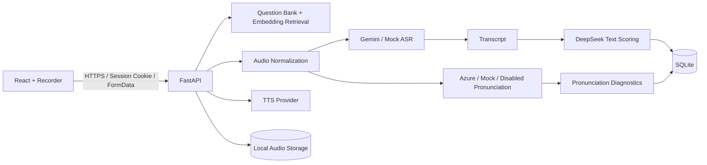

# AI Speaking Coach

AI Speaking Coach 是一个面向 IELTS Speaking 的 AI 语音练习与评分 Web 应用，也是一个涵盖产品设计、LLM 工作流、语音处理、访问控制与云端部署的全栈作品集项目。

当前版本支持题库驱动的分项练习、11 题 Full Mock、考官语音、浏览器录音、ASR、发音评估、结构化评分和历史回放。线上版本采用单管理员私有演示模式，避免公开消耗项目所有者的 LLM 与 Speech API 配额。

> 线上应用：[https://ai-speaking-coach-2fxn.onrender.com](https://ai-speaking-coach-2fxn.onrender.com)
>
> 健康检查：[https://ai-speaking-coach-2fxn.onrender.com/api/health](https://ai-speaking-coach-2fxn.onrender.com/api/health)
>
> 线上版本采用单管理员私有演示模式，无公开注册；使用应用功能需要管理员账号。

## 核心产品能力

- **Full Mock**：按 6/1/4 组成 11 题完整练习，每题录音后独立转写与评分，结束时由后端本地聚合整场报告；Overview 只展示总分、四项分数与 Azure 平均发音分，详细反馈按 Part 和题目查看。
- **Targeted Practice**：按 Part 1、Part 2、Part 3 进行单题专项练习。
- **题库检索与组卷**：支持随机抽题和基于 practice goal 的 embedding 检索；LLM 只能从候选 ID 中选择，不能改写题目。
- **语音交互**：TTS 播放考官题目，浏览器录制回答，后端统一转换音频格式。
- **多模型反馈**：Gemini ASR 转写、DeepSeek 文本评分、Azure Pronunciation Assessment 发音诊断。
- **历史记录**：保存练习报告和关联录音，支持回放、详情查看与批量删除。
- **私有访问控制**：单管理员 Session 登录，无公开注册，不在浏览器保存密码或 token。

## 登录与安全设计

读取历史记录或调用 LLM、ASR、TTS、embedding、Azure Pronunciation Assessment 的功能都需要管理员登录。认证使用 8 小时签名 Session 和 HttpOnly Cookie，不使用 JWT；生产环境 Cookie 自动启用 `Secure`，并固定为 `SameSite=Lax`。

公开接口仅包括 `/api/health` 和 `/api/auth/*`。examiner、feedback、practices、mock-tests、speaking 五组业务 Router 在注册层统一使用 `require_auth`，未认证请求会在调用付费 Provider 或读取业务数据前返回 401。

API Key 和管理员 Secret 只允许存在于后端环境变量。不要使用 `VITE_API_KEY`、`REACT_APP_API_KEY`、`NEXT_PUBLIC_API_KEY` 等会进入浏览器构建产物的变量。真实 `.env`、SQLite、录音、采集缓存和构建产物均被 Git 忽略。

## 生产部署设计

当前支持一个带持久盘的 Render Docker Web Service。FastAPI 在同一 HTTPS 域名下提供 Vite 前端和 `/api`，从而保持简单可靠的同域 Session。生产启动会校验管理员配置、bcrypt hash、Session secret 和显式 HTTPS CORS origin，配置不安全时拒绝启动。

如果未来改成前后端跨站部署，需要显式调整为 `SameSite=None + Secure`、设置 credentialed CORS，并继续让前端携带 Cookie；不能使用通配符 CORS。

### Render 部署步骤

仓库根目录的 `Dockerfile` 会先用固定 Node 版本构建 React/Vite，再用固定 Python 版本运行 FastAPI。`render.yaml` 声明一个 Render Docker Web Service、`/api/health` 健康检查，以及挂载到 `/var/data` 的 1 GB 持久盘。

1. 将仓库推送到 GitHub，在 Render 中选择 **New Blueprint Instance** 并连接仓库。
2. 使用 Starter 或更高规格。SQLite 与录音要求单实例运行，不要横向扩展该服务。
3. 在首次部署前填写以下 Secret 环境变量：

   | 变量 | 用途 |
   | --- | --- |
   | `CORS_ORIGINS` | 当前服务填写 `https://ai-speaking-coach-2fxn.onrender.com`；自定义域名后同步更新为实际 HTTPS 地址 |
   | `ADMIN_USERNAME` | 私有演示管理员用户名 |
   | `ADMIN_PASSWORD_HASH` | `scripts/generate_password_hash.py` 生成的 bcrypt hash |
   | `DEEPSEEK_API_KEY` | 组卷选择与文本评分 |
   | `GEMINI_API_KEY` | TTS、ASR 与题库 embedding |
   | `AZURE_SPEECH_KEY` | Azure Pronunciation Assessment；启用 Azure 时填写 |
   | `AZURE_SPEECH_REGION` | Azure Speech region；启用 Azure 时填写 |

   `SESSION_SECRET_KEY` 默认由 Render Blueprint 生成。若手动设置，必须使用至少 32 个随机字符，且更新后所有现有 Session 会失效。

4. Blueprint 已设置以下非敏感生产值：

   ```dotenv
   APP_ENV=production
   DATABASE_URL=sqlite:////var/data/app.db
   AUDIO_STORAGE_DIR=/var/data/audio
   FRONTEND_DIST_DIR=/app/frontend/dist
   TTS_PROVIDER=gemini
   ASR_PROVIDER=gemini
   PRONUNCIATION_PROVIDER=azure
   ```

5. 每次容器启动会依次执行 Alembic migration、幂等导入演示 seed、仅补齐缺失或过期的 embeddings，然后启动 Uvicorn。任何初始化步骤失败都会终止部署，避免暴露半初始化服务。

首次部署会为 60 道演示题生成 embeddings，因此必须提供有效的 `GEMINI_API_KEY`。持久盘保留后，后续重启会跳过相同题目和未变化的 embeddings。

### 持久化与恢复

- SQLite、练习历史和题库位于 `/var/data/app.db`；录音位于 `/var/data/audio`。
- 持久盘未挂载、被删除或更换服务时，历史和录音不可恢复。部署前应确认 Render Events 中的实际挂载路径。
- 演示 seed 可以重新建立基础题库，但不会恢复用户历史或录音。重要展示数据应定期备份数据库与音频目录。
- 当前 SQLite 方案只支持单实例作品展示。需要多实例、并发写入或托管备份时，再迁移到 PostgreSQL，并将录音迁移到对象存储。

### 部署故障排查

- `Unsafe production configuration`：检查管理员、bcrypt hash、Session secret 和 HTTPS `CORS_ORIGINS`。
- `GEMINI_API_KEY is not configured`：首次 seed embedding 尚未完成，填写 Key 后重新部署。
- 页面返回 `Frontend build is not available`：检查 Docker 前端构建阶段及 `FRONTEND_DIST_DIR`。
- 重启后数据丢失：确认 `DATABASE_URL` 和 `AUDIO_STORAGE_DIR` 都指向 `/var/data`，并确认持久盘已挂载。
- 登录成功后仍返回 401：确认浏览器使用 Render HTTPS 域名，不要通过 HTTP 或另一域名访问。

## Azure Pronunciation Assessment

语音答案可在保留 Gemini ASR 和 DeepSeek 评分的同时，使用 Azure Speech 对原始录音进行发音评估。Azure 返回 0–100 原始分，页面同时显示明确标注为 estimated 的 IELTS 0–9 启发式分数。Full Mock 在发音数据可用时将其纳入后端等权 Overall 计算；Targeted Practice 继续将发音诊断独立展示。Azure 不可用时会降级为 N/A，不阻断转写和其他文本评分。

在 `backend/.env` 中配置并重启后端：

```dotenv
PRONUNCIATION_PROVIDER=azure
AZURE_SPEECH_KEY=your_azure_speech_key
AZURE_SPEECH_REGION=your_azure_speech_region
AZURE_SPEECH_LANGUAGE=en-US
AZURE_PRONUNCIATION_TIMEOUT_SECONDS=330
```

真实 Key 只能保存在未提交的 `backend/.env` 中。`PRONUNCIATION_PROVIDER` 还支持 `mock` 和 `disabled`。

## 功能特性

- 支持题库驱动的 Targeted Part Practice 与 6/1/4 共 11 题的 Full Speaking Mock Test
- practiceGoal 可按主题语义检索 approved 题库，LLM 只从候选 ID 中选择
- Gemini TTS Provider 生成考官语音，Mock TTS 支持无 Key 本地开发
- 基于 `react-media-recorder` 录制用户回答，每道题最长可录制 3 分钟
- ASR Provider 将录音转为 transcript，支持 Gemini ASR 与 Mock ASR
- Gemini ASR 对临时 429/503 使用有限指数退避重试，降低 Full Mock 因单题 Provider 波动而整场失败的概率
- DeepSeek 提供流利度、词汇、语法、纠错、优化答案及下一步建议
- DeepSeek 单题评分对网络异常及 429/5xx 使用有限指数退避重试；Full Mock 不再发起整场长报告请求
- Azure Pronunciation Assessment 基于原始音频提供 PronScore、Accuracy、Fluency、Prosody 和低分单词
- 使用 SQLite 与本地音频目录持久化练习记录和录音
- 支持历史列表和练习详情查看
- 支持浅色、暗色和跟随系统三种页面主题
- 支持可收起侧栏和响应式页面布局

> `mock` Provider 用于无外部 Key 的本地开发；真实链路可配置 Gemini TTS、Gemini ASR 与 Azure Pronunciation。Azure 失败时发音维度降级为 N/A，Gemini 转写和 DeepSeek 文本评分仍继续执行。

## 技术栈

### 前端

- React 19
- TypeScript
- Vite 6
- Material UI 9
- Emotion
- react-media-recorder

### 后端

- Python
- FastAPI
- SQLAlchemy
- Pydantic Settings
- SQLite
- DeepSeek Chat API
- Gemini TTS / Mock TTS
- Gemini ASR / Mock ASR Provider
- Azure / Mock / Disabled Pronunciation Provider
- Azure Cognitive Services Speech SDK
- Alembic

## 系统架构



## 业务流程

1. 管理员登录后选择 Full Mock 或 IELTS Speaking Part 1、Part 2、Part 3 分项练习。
2. 后端从 approved 题库随机抽题，或根据 practice goal 检索候选并让 LLM 选择候选 ID；Gemini/Mock TTS 返回考官音频。
3. 用户录音后，前端以 FormData 上传音频。
4. 后端将音频统一转换为 16 kHz、16-bit、单声道 PCM WAV。
5. ASR Provider 返回 transcript，DeepSeek 对文本进行结构化评分；Pronunciation Provider 独立评估原始语音表现。
6. 后端保存录音、transcript、文本反馈和发音诊断；Azure 不可用时只将发音维度降级为 N/A。
7. 新版 Full Mock 从审核题库组成 6/1/4 共 11 题；每次 Next 都先完成当前题的转写、发音评估和文本评分，Finish Test 只执行确定性本地聚合与归档，不再发起整场 LLM 请求。旧 4/1/3 数据结构继续兼容。
8. Full Mock 结果页的 Overview 只保留分数；Part 页签顶部仅保留左对齐的 Part band，不再展示拼接的 Part feedback。逐题标题不重复展示 Overall band，Criteria Scores 使用蓝色 Overall 卡片，Strengths/Weaknesses 只在各题 Analysis 内展示。

## 项目结构

```text
ai-speaking-coach/
├─ Dockerfile               # 前端构建与 FastAPI 生产镜像
├─ render.yaml              # Render Blueprint 与持久盘配置
├─ backend/
│  ├─ app/
│  │  ├─ agents/          # Examiner 与 Feedback Agent
│  │  ├─ api/routes/      # FastAPI 路由
│  │  ├─ llm/             # DeepSeek Provider 与 JSON 解析
│  │  ├─ models/          # SQLAlchemy 模型
│  │  ├─ prompts/         # LLM Prompt
│  │  ├─ schemas/         # 请求与响应模型
│  │  ├─ question_bank/   # 采集、审核、检索与 embedding
│  │  └─ services/        # 练习、录音和组卷服务
│  ├─ alembic/            # 数据库迁移
│  ├─ data/question_bank/seed/ # 可提交的演示题库
│  ├─ scripts/            # 密码 hash 与生产启动脚本
│  └─ requirements.txt
├─ frontend/
│  ├─ src/
│  │  ├─ api/             # 前端 API 客户端
│  │  ├─ components/      # 通用 UI 组件
│  │  ├─ pages/           # 业务页面
│  │  └─ theme.ts         # Material UI 主题
│  └─ package.json
├─ docs/screenshots/        # 发布前的脱敏产品截图
└─ README.md
```

## 环境要求

- Python 3.12（生产镜像固定为 3.12.11）
- Node.js 22（生产构建固定为 22.16.0）
- npm
- 可用的 DeepSeek API Key

## 本地运行

### 1. 启动后端

在项目根目录执行：

```powershell
cd backend
python -m venv .venv
.\.venv\Scripts\python.exe -m pip install -r requirements.txt
```

复制 `backend/.env.example` 为 `backend/.env`，先配置管理员和本地 Provider：

```dotenv
APP_ENV=development
ADMIN_USERNAME=your_admin_username
ADMIN_PASSWORD_HASH=your_bcrypt_password_hash
SESSION_SECRET_KEY=your_random_session_secret_of_at_least_32_characters
DEEPSEEK_API_KEY=your_api_key_here
DEEPSEEK_BASE_URL=https://api.deepseek.com
DEEPSEEK_MODEL=deepseek-chat
DATABASE_URL=sqlite:///./data/app.db
TTS_PROVIDER=mock
ASR_PROVIDER=mock
GEMINI_ASR_MODEL=gemini-2.5-flash
GEMINI_EMBEDDING_MODEL=gemini-embedding-001
GEMINI_EMBEDDING_DIMENSIONS=768
PRONUNCIATION_PROVIDER=disabled
AZURE_SPEECH_KEY=
AZURE_SPEECH_REGION=
AZURE_SPEECH_LANGUAGE=en-US
AZURE_PRONUNCIATION_TIMEOUT_SECONDS=330
```

首次创建数据库：

```powershell
.\.venv\Scripts\python.exe -m alembic upgrade head
.\.venv\Scripts\python.exe -m app.question_bank.scripts.import_questions --file data/question_bank/seed/seed_questions.json
```

使用 `scripts/generate_password_hash.py` 交互式生成 `ADMIN_PASSWORD_HASH`。如果需要 practice goal 语义检索，再配置 `GEMINI_API_KEY` 并运行 `generate_embeddings`。

已有旧版数据库需先执行一次 `alembic stamp 0001_baseline`，再执行 `alembic upgrade head`。

启动 FastAPI：

```powershell
.\.venv\Scripts\python.exe -m uvicorn app.main:app --reload --port 8010
```

启动后可通过 `/api/health` 检查后端状态。

### 2. 启动前端

另开一个终端，在项目根目录执行：

```powershell
cd frontend
npm install
npm run dev
```

Vite 开发服务器会将前端的 `/api` 请求代理到本地后端。

## API 接口

| 方法 | 路径 | 说明 |
| --- | --- | --- |
| GET | `/api/health` | 后端健康检查 |
| POST | `/api/auth/login` | 管理员登录 |
| POST | `/api/auth/logout` | 注销当前 Session |
| GET | `/api/auth/me` | 获取当前登录状态 |
| POST | `/api/examiner/generate` | 生成口语题目 |
| POST | `/api/feedback/evaluate` | 评估回答并保存记录 |
| POST | `/api/speaking/tts` | 生成考官语音并返回 WAV |
| POST | `/api/speaking/voice-answer` | 上传录音、转写并评分 |
| POST | `/api/speaking/mock-test/answer` | 上传并评分一道 Full Mock 录音 |
| POST | `/api/speaking/mock-test/finalize` | 本地聚合已评分答案并幂等归档 Full Mock |
| GET | `/api/speaking/audio/{id}` | 播放持久化录音 |
| DELETE | `/api/speaking/audio/{id}` | 删除未关联的重录音频 |
| POST | `/api/mock-tests/generate` | 生成 4/1/3 Full Mock |
| POST | `/api/mock-tests/start` | 按可选 practiceGoal 从题库组成 6/1/4 Full Mock |
| POST | `/api/practices/section/start` | 按 Part 和可选 practiceGoal 选择一道分项练习题 |
| POST | `/api/mock-tests/evaluate` | 生成并保存 Full Mock 总评 |
| GET | `/api/practices` | 获取练习历史列表 |
| GET | `/api/practices/{id}` | 获取单条练习详情 |
| DELETE | `/api/practices/{id}` | 删除分项练习及关联录音 |
| GET | `/api/mock-tests` | 获取 Full Mock 历史列表 |
| GET | `/api/mock-tests/{id}` | 获取单条 Full Mock 报告 |
| DELETE | `/api/mock-tests/{id}` | 删除 Full Mock 报告及关联录音 |

## 前端构建

```powershell
cd frontend
npm run build
```

前端组件测试：

```powershell
cd frontend
npm test
```

构建产物生成在 `frontend/dist`，该目录不会提交到 Git。

## 产品截图

截图清单与脱敏要求见 [`docs/screenshots/README.md`](docs/screenshots/README.md)。正式作品集建议至少展示登录、模式选择、Full Mock 录音流程、分项反馈和练习历史；不要包含真实凭据、API Key、个人录音或可识别信息。

## 数据与安全

- `backend/.env` 包含 API Key，不应提交到版本库。
- SQLite 数据默认保存在 `backend/data/app.db`，该文件不会提交到版本库。
- 线上 Render 使用 `/var/data/app.db` 和 `/var/data/audio`，二者必须位于持久盘。
- `PROJECT_MEMORY.md` 是本地开发交接文档，不会提交到版本库。
- 不要在日志、截图或提交记录中暴露真实的 `DEEPSEEK_API_KEY`。
- `GEMINI_API_KEY` 只允许放在后端环境变量中。
- `AZURE_SPEECH_KEY` 只允许放在后端环境变量中。
- 已完成录音随历史记录保留；未关联的 pending 录音在 24 小时后清理。

## IELTS Speaking practice question bank

仓库包含 60 道项目自编的英文演示题：Part 1/2/3 分别为 30/10/20。它们用于让全新部署具备可验证的基础流程，不属于官方 IELTS 真题，也不代表真实考试预测。完整本地审核题库、采集缓存、数据库和 embeddings 不提交 GitHub。

题库采集是独立的离线审核流水线，不会直接改变现有 Examiner Agent 或练习 API。配置文件和人工维护的 seed 可以提交 Git；HTML 缓存、raw、cleaned、review CSV 和 SQLite 数据均被忽略。

从 `backend/` 运行：

```powershell
python -m app.question_bank.scripts.crawl_questions --sources data/question_bank/sources/question_sources.local.json --limit 3 --dry-run
python -m app.question_bank.scripts.crawl_questions --source-name "British Council Take IELTS - Speaking Practice Test" --limit 3
python -m app.question_bank.scripts.clean_questions --input data/question_bank/raw
python -m app.question_bank.scripts.export_questions --status pending_review --output data/question_bank/review/questions_review.csv
python -m app.question_bank.scripts.import_questions --file data/question_bank/review/questions_review.csv
python -m app.question_bank.scripts.import_questions --file data/question_bank/seed/seed_questions.json
python -m app.question_bank.scripts.generate_embeddings --batch-size 50
```

采集流程固定为 `sources → raw JSON → cleaned JSON → review CSV → 人工审核 → SQLite`。Crawler 不写数据库；审核 CSV 中只有明确标为 `approved` 的记录会被导入。JSON 中未提供状态的记录默认为 `pending_review`。

### Full Mock 语义检索

先执行 `alembic upgrade head`，导入 approved 题目，再运行 `generate_embeddings`。命令使用后端 `GEMINI_API_KEY`、`gemini-embedding-001` 和 768 维向量；向量以 float32 BLOB 保存到 SQLite。未变化的题目会按模型和 `embedding_text` 指纹跳过，可用 `--limit` 小规模验证或用 `--force` 重建。

启动一套默认题库组卷：调用 `POST /api/mock-tests/start`，请求体为 `{"practiceGoal":""}`。

启动目标检索组卷：调用 `POST /api/mock-tests/start`，请求体为 `{"practiceGoal":"technology and environment"}`。

空目标使用纯规则组卷。非空目标分别检索 Part 1/2/3 候选，再由 DeepSeek 仅返回候选 ID；后端校验并回填原题。LLM 输出无效时使用检索候选规则组卷；embedding 未配置或索引缺失时返回默认题库组卷，并在 metadata 中明确标记 fallback。所有用户可见题目仅来自 `status=approved` 的 practice question bank。

### Section Practice 题库选择

分项练习每次只返回一道当前 Part 的题目；Part 2 返回完整 cue card。空目标直接从 approved 题库随机选择，不调用 embedding 或 LLM；非空目标只检索所选 Part，并让 DeepSeek 返回一个候选 ID。LLM 输出无效时使用相似度最高的候选，embedding 不可用时降级为当前 Part 的随机 approved 题。

调用 `POST /api/practices/section/start`，例如请求体 `{"part":"part1","practiceGoal":"technology"}`。

`sources/question_sources.json` 和 example 配置默认不启用来源。本地配置只用于小规模验证；启用前必须人工确认页面公开可访问、无需登录或付费、适合自动解析，并检查网站条款。运行时仍会读取 robots.txt；无法可靠确认许可、出现验证码、Cloudflare 挑战、登录、付费墙或非 HTML 内容时会停止该 URL，并要求改用人工 CSV/JSON 导入。IELTS.org PDF 第一版不自动解析。产品和文档只能称其为 IELTS Speaking practice question bank，不得宣称“官方真题库”。

## 当前版本范围

流利度、词汇和语法等维度由 DeepSeek 基于 transcript 评分；Azure 独立分析真实音频的发音表现。Estimated IELTS Pronunciation 使用 Azure PronScore 的启发式换算，不是 Azure 或 IELTS 官方分数。当前部署面向单管理员、单实例作品展示；公开用户账号、多租户、OpenAI ASR、PostgreSQL、多实例部署和云对象存储属于后续范围。原文字评分 API、旧 4/1/3 Full Mock 和旧历史 JSON 继续作为兼容入口保留。
