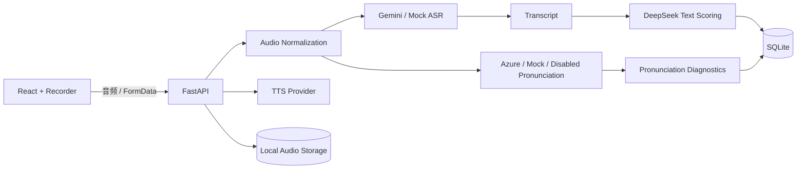

# AI Speaking Coach

## Private demo login and deployment security

This repository is an AI Speaking Coach portfolio demo. Features that read practice history or call LLM, ASR, TTS, embedding, and Azure Pronunciation Assessment services require the single administrator account. There is no public registration and no JWT: authentication uses an 8-hour signed session in an HttpOnly cookie.

### Local setup

1. Install backend dependencies and copy the environment template:

   ```powershell
   cd backend
   python -m venv .venv
   .venv\Scripts\python.exe -m pip install -r requirements.txt
   Copy-Item .env.example .env
   ```

2. Generate the administrator password hash. The script hides and confirms the password, then prints only the bcrypt hash:

   ```powershell
   .venv\Scripts\python.exe scripts\generate_password_hash.py
   ```

3. Put the generated value in `ADMIN_PASSWORD_HASH`, choose `ADMIN_USERNAME`, and generate a random `SESSION_SECRET_KEY` containing at least 32 characters. Keep `APP_ENV=development` locally. Add provider keys only for the providers you enable.

4. Start the backend from `backend` and the frontend from `frontend`:

   ```powershell
   # backend
   .venv\Scripts\python.exe -m uvicorn app.main:app --host 127.0.0.1 --port 8010

   # frontend
   npm install
   npm run dev
   ```

Vite proxies `/api` to the local FastAPI server, so browser requests remain same-origin. Every frontend API wrapper sends `credentials: "include"`.

### Production deployment

Use one HTTPS origin and reverse-proxy `/api` to FastAPI. Set `APP_ENV=production`, an explicit HTTPS `CORS_ORIGINS`, a bcrypt `ADMIN_PASSWORD_HASH`, and a strong `SESSION_SECRET_KEY`. Production startup rejects missing or unsafe authentication settings. Production cookies are HttpOnly, Secure, SameSite=Lax, and expire after eight hours.

If the frontend and API must be deployed cross-site, the implementation must be deliberately changed to `SameSite=None` with `Secure`, FastAPI must use an explicit frontend origin with `allow_credentials=True`, and the frontend must continue sending credentials. Wildcard CORS origins are not compatible with credentialed requests.

API keys and administrator secrets belong only in backend environment variables. Never use `VITE_API_KEY`, `REACT_APP_API_KEY`, `NEXT_PUBLIC_API_KEY`, or any other browser-exposed variable for private credentials. `.env` variants are ignored by Git; only sanitized `.env.example` files may be committed. Before publishing, scan tracked files and Git history for secrets and rotate any key that has ever been committed.

Public endpoints are limited to `/api/health` and `/api/auth/login`, `/api/auth/logout`, `/api/auth/me`. All examiner, feedback, practice, mock-test, speech, history, and recording endpoints require a valid session.

## Azure Pronunciation Assessment（2026-06-30）

语音答案现在可在保留 Gemini ASR 和 DeepSeek 评分的同时，使用 Azure Speech 对原始录音进行发音评估。Azure 返回 0–100 原始分，页面同时显示明确标注为 estimated 的 IELTS 0–9 启发式分数；该分数不参与现有 Overall 计算。Azure 不可用时会降级为 N/A，不阻断转写和其他评分。

在 `backend/.env` 中配置并重启后端：

```dotenv
PRONUNCIATION_PROVIDER=azure
AZURE_SPEECH_KEY=your_azure_speech_key
AZURE_SPEECH_REGION=your_azure_speech_region
AZURE_SPEECH_LANGUAGE=en-US
AZURE_PRONUNCIATION_TIMEOUT_SECONDS=330
```

真实 Key 只能保存在未提交的 `backend/.env` 中。`PRONUNCIATION_PROVIDER` 还支持 `mock` 和 `disabled`。

AI Speaking Coach 是一个面向 IELTS Speaking（雅思口语）的语音练习全栈 MVP。应用支持考官语音、浏览器录音、可替换 ASR、DeepSeek 结构化评分，以及带录音回放的历史记录。

## 功能特性

- 支持题库驱动的 Targeted Part Practice 与 6/1/4 共 11 题的 Full Speaking Mock Test
- practiceGoal 可按主题语义检索 approved 题库，LLM 只从候选 ID 中选择
- Gemini TTS Provider 生成考官语音，Mock TTS 支持无 Key 本地开发
- 基于 `react-media-recorder` 录制用户回答，每道题最长可录制 3 分钟
- ASR Provider 将录音转为 transcript，支持 Gemini ASR 与 Mock ASR
- DeepSeek 提供流利度、词汇、语法、纠错、优化答案及下一步建议
- Azure Pronunciation Assessment 基于原始音频提供 PronScore、Accuracy、Fluency、Prosody 和低分单词
- 使用 SQLite 与本地音频目录持久化练习记录和录音
- 支持历史列表和练习详情查看
- 支持浅色、暗色和跟随系统三种页面主题
- 支持可收起侧栏和响应式页面布局

> `mock` Provider 用于无外部 Key 的本地开发；真实链路可配置 Gemini TTS、Gemini ASR 与 Azure Pronunciation。Azure 失败时发音维度降级为 N/A，Gemini 转写和 DeepSeek 文本评分仍继续执行。

## 技术栈

### 前端

- React 19
- TypeScript
- Vite 6
- Material UI 9
- Emotion
- react-media-recorder

### 后端

- Python
- FastAPI
- SQLAlchemy
- Pydantic Settings
- SQLite
- DeepSeek Chat API
- Gemini TTS / Mock TTS
- Gemini ASR / Mock ASR Provider
- Azure / Mock / Disabled Pronunciation Provider
- Azure Cognitive Services Speech SDK
- Alembic

## 系统架构



## 业务流程

1. 用户选择 IELTS Speaking Part 1、Part 2 或 Part 3。
2. Examiner Agent 生成题目，Gemini/Mock TTS 返回可播放考官音频。
3. 用户录音后，前端以 FormData 上传音频。
4. 后端将音频统一转换为 16 kHz、16-bit、单声道 PCM WAV。
5. ASR Provider 返回 transcript，DeepSeek 对文本进行结构化评分；Pronunciation Provider 独立评估原始语音表现。
6. 后端保存录音、transcript、文本反馈和发音诊断；Azure 不可用时只将发音维度降级为 N/A。
7. 新版 Full Mock 从审核题库组成 6/1/4 共 11 题；考试中只在浏览器保存每题录音，Finish Test 后通过一次 multipart 请求统一转写、发音评估和整场评分。旧 4/1/3 接口继续兼容。

## 项目结构

```text
ai-speaking-coach/
├─ backend/
│  ├─ app/
│  │  ├─ agents/          # Examiner 与 Feedback Agent
│  │  ├─ api/routes/      # FastAPI 路由
│  │  ├─ llm/             # DeepSeek Provider 与 JSON 解析
│  │  ├─ models/          # SQLAlchemy 模型
│  │  ├─ prompts/         # LLM Prompt
│  │  ├─ schemas/         # 请求与响应模型
│  │  └─ services/        # 练习记录服务
│  └─ requirements.txt
├─ frontend/
│  ├─ src/
│  │  ├─ api/             # 前端 API 客户端
│  │  ├─ components/      # 通用 UI 组件
│  │  ├─ pages/           # 业务页面
│  │  └─ theme.ts         # Material UI 主题
│  └─ package.json
└─ README.md
```

## 环境要求

- Python 3.10 或更高版本
- Node.js 20 或更高版本
- npm
- 可用的 DeepSeek API Key

## 本地运行

### 1. 启动后端

在项目根目录执行：

```powershell
cd backend
python -m venv .venv
.\.venv\Scripts\python.exe -m pip install -r requirements.txt
```

复制 `backend/.env.example` 为 `backend/.env`，至少配置 DeepSeek：

```dotenv
DEEPSEEK_API_KEY=your_api_key_here
DEEPSEEK_BASE_URL=https://api.deepseek.com
DEEPSEEK_MODEL=deepseek-chat
DATABASE_URL=sqlite:///./data/app.db
CORS_ORIGINS=http://127.0.0.1:5180,http://localhost:5180
TTS_PROVIDER=mock
ASR_PROVIDER=mock
GEMINI_ASR_MODEL=gemini-2.5-flash
GEMINI_EMBEDDING_MODEL=gemini-embedding-001
GEMINI_EMBEDDING_DIMENSIONS=768
PRONUNCIATION_PROVIDER=disabled
AZURE_SPEECH_KEY=
AZURE_SPEECH_REGION=
AZURE_SPEECH_LANGUAGE=en-US
AZURE_PRONUNCIATION_TIMEOUT_SECONDS=330
```

首次创建数据库：

```powershell
.\.venv\Scripts\python.exe -m alembic upgrade head
```

已有旧版数据库需先执行一次 `alembic stamp 0001_baseline`，再执行 `alembic upgrade head`。

启动 FastAPI：

```powershell
.\.venv\Scripts\python.exe -m uvicorn app.main:app --reload --host 127.0.0.1 --port 8010
```

健康检查地址：<http://127.0.0.1:8010/api/health>

### 2. 启动前端

另开一个终端，在项目根目录执行：

```powershell
cd frontend
npm install
npm run dev
```

浏览器访问：<http://127.0.0.1:5180>

Vite 会将前端的 `/api` 请求代理到 `http://127.0.0.1:8010`。

## API 接口

| 方法 | 路径 | 说明 |
| --- | --- | --- |
| GET | `/api/health` | 后端健康检查 |
| POST | `/api/examiner/generate` | 生成口语题目 |
| POST | `/api/feedback/evaluate` | 评估回答并保存记录 |
| POST | `/api/speaking/tts` | 生成考官语音并返回 WAV |
| POST | `/api/speaking/voice-answer` | 上传录音、转写并评分 |
| POST | `/api/speaking/mock-test/submit` | 一次上传 Full Mock 全部录音并生成整场报告 |
| GET | `/api/speaking/audio/{id}` | 播放持久化录音 |
| DELETE | `/api/speaking/audio/{id}` | 删除未关联的重录音频 |
| POST | `/api/mock-tests/generate` | 生成 4/1/3 Full Mock |
| POST | `/api/mock-tests/start` | 按可选 practiceGoal 从题库组成 6/1/4 Full Mock |
| POST | `/api/practices/section/start` | 按 Part 和可选 practiceGoal 选择一道分项练习题 |
| POST | `/api/mock-tests/evaluate` | 生成并保存 Full Mock 总评 |
| GET | `/api/practices` | 获取练习历史列表 |
| GET | `/api/practices/{id}` | 获取单条练习详情 |
| DELETE | `/api/practices/{id}` | 删除分项练习及关联录音 |
| GET | `/api/mock-tests` | 获取 Full Mock 历史列表 |
| GET | `/api/mock-tests/{id}` | 获取单条 Full Mock 报告 |
| DELETE | `/api/mock-tests/{id}` | 删除 Full Mock 报告及关联录音 |

## 前端构建

```powershell
cd frontend
npm run build
```

前端组件测试：

```powershell
cd frontend
npm test
```

构建产物生成在 `frontend/dist`，该目录不会提交到 Git。

## 数据与安全

- `backend/.env` 包含 API Key，不应提交到版本库。
- SQLite 数据默认保存在 `backend/data/app.db`，该文件不会提交到版本库。
- `PROJECT_MEMORY.md` 是本地开发交接文档，不会提交到版本库。
- 不要在日志、截图或提交记录中暴露真实的 `DEEPSEEK_API_KEY`。
- `GEMINI_API_KEY` 只允许放在后端环境变量中。
- `AZURE_SPEECH_KEY` 只允许放在后端环境变量中。
- 已完成录音随历史记录保留；未关联的 pending 录音在 24 小时后清理。

## IELTS Speaking practice question bank

题库采集是独立的离线审核流水线，不会直接改变现有 Examiner Agent 或练习 API。配置文件和人工维护的 seed 可以提交 Git；HTML 缓存、raw、cleaned、review CSV 和 SQLite 数据均被忽略。

从 `backend/` 运行：

```powershell
python -m app.question_bank.scripts.crawl_questions --sources data/question_bank/sources/question_sources.local.json --limit 3 --dry-run
python -m app.question_bank.scripts.crawl_questions --source-name "British Council Take IELTS - Speaking Practice Test" --limit 3
python -m app.question_bank.scripts.clean_questions --input data/question_bank/raw
python -m app.question_bank.scripts.export_questions --status pending_review --output data/question_bank/review/questions_review.csv
python -m app.question_bank.scripts.import_questions --file data/question_bank/review/questions_review.csv
python -m app.question_bank.scripts.import_questions --file data/question_bank/seed/seed_questions.json
python -m app.question_bank.scripts.generate_embeddings --batch-size 50
```

采集流程固定为 `sources → raw JSON → cleaned JSON → review CSV → 人工审核 → SQLite`。Crawler 不写数据库；审核 CSV 中只有明确标为 `approved` 的记录会被导入。JSON 中未提供状态的记录默认为 `pending_review`。

### Full Mock 语义检索

先执行 `alembic upgrade head`，导入 approved 题目，再运行 `generate_embeddings`。命令使用后端 `GEMINI_API_KEY`、`gemini-embedding-001` 和 768 维向量；向量以 float32 BLOB 保存到 SQLite。未变化的题目会按模型和 `embedding_text` 指纹跳过，可用 `--limit` 小规模验证或用 `--force` 重建。

启动一套默认题库组卷：

```powershell
Invoke-RestMethod -Method Post -Uri http://127.0.0.1:8010/api/mock-tests/start -ContentType application/json -Body '{"practiceGoal":""}'
```

启动目标检索组卷：

```powershell
Invoke-RestMethod -Method Post -Uri http://127.0.0.1:8010/api/mock-tests/start -ContentType application/json -Body '{"practiceGoal":"technology and environment"}'
```

空目标使用纯规则组卷。非空目标分别检索 Part 1/2/3 候选，再由 DeepSeek 仅返回候选 ID；后端校验并回填原题。LLM 输出无效时使用检索候选规则组卷；embedding 未配置或索引缺失时返回默认题库组卷，并在 metadata 中明确标记 fallback。所有用户可见题目仅来自 `status=approved` 的 practice question bank。

### Section Practice 题库选择

分项练习每次只返回一道当前 Part 的题目；Part 2 返回完整 cue card。空目标直接从 approved 题库随机选择，不调用 embedding 或 LLM；非空目标只检索所选 Part，并让 DeepSeek 返回一个候选 ID。LLM 输出无效时使用相似度最高的候选，embedding 不可用时降级为当前 Part 的随机 approved 题。

```powershell
Invoke-RestMethod -Method Post -Uri http://127.0.0.1:8010/api/practices/section/start -ContentType application/json -Body '{"part":"part1","practiceGoal":"technology"}'
```

`sources/question_sources.json` 和 example 配置默认不启用来源。本地配置只用于小规模验证；启用前必须人工确认页面公开可访问、无需登录或付费、适合自动解析，并检查网站条款。运行时仍会读取 robots.txt；无法可靠确认许可、出现验证码、Cloudflare 挑战、登录、付费墙或非 HTML 内容时会停止该 URL，并要求改用人工 CSV/JSON 导入。IELTS.org PDF 第一版不自动解析。产品和文档只能称其为 IELTS Speaking practice question bank，不得宣称“官方真题库”。

## 当前版本范围

流利度、词汇和语法等维度仍由 DeepSeek 基于 transcript 评分；Azure 独立分析真实音频的发音表现。Estimated IELTS Pronunciation 使用 Azure PronScore 的启发式换算，不是 Azure 或 IELTS 官方分数，且不参与当前 Overall 计算。OpenAI ASR、用户账号、云对象存储和部署配置仍属于后续范围；原文字评分 API 保留作为兼容入口。
