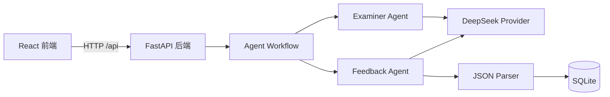

# AI Speaking Coach

AI Speaking Coach 是一个面向 IELTS Speaking（雅思口语）练习的全栈 MVP。用户可以选择 Part 1、Part 2 或 Part 3，由 AI 生成考官风格题目，提交文本回答后获得结构化评分、优缺点分析、改进答案和行动建议，并可在历史记录中查看以往练习详情。

## 功能特性

- 支持 IELTS Speaking Part 1、Part 2、Part 3 三种练习模式
- AI Examiner Agent 根据口语部分生成结构化考题
- AI Feedback Agent 提供流利度、词汇、语法及综合分数
- 展示回答优点、问题、改进示例和后续练习建议
- 使用 SQLite 持久化保存练习记录
- 支持历史列表和练习详情查看
- 支持浅色、暗色和跟随系统三种页面主题
- 支持可收起侧栏和响应式页面布局

> 当前版本使用文本输入，不包含录音、语音识别和发音评分。

## 技术栈

### 前端

- React 19
- TypeScript
- Vite 6
- Material UI 9
- Emotion

### 后端

- Python
- FastAPI
- SQLAlchemy
- Pydantic Settings
- SQLite
- DeepSeek Chat API

## 系统架构



## 业务流程

1. 用户选择 IELTS Speaking Part 1、Part 2 或 Part 3。
2. Examiner Agent 调用 DeepSeek API 生成对应类型的题目。
3. 用户输入文本回答并提交。
4. Feedback Agent 按 IELTS 风格的维度生成结构化反馈。
5. 后端校验模型返回的 JSON，并保存题目、回答、反馈和分数。
6. 前端展示结果，用户可继续练习或查看历史记录。

## 项目结构

```text
ai-speaking-coach/
├─ backend/
│  ├─ app/
│  │  ├─ agents/          # Examiner 与 Feedback Agent
│  │  ├─ api/routes/      # FastAPI 路由
│  │  ├─ llm/             # DeepSeek Provider 与 JSON 解析
│  │  ├─ models/          # SQLAlchemy 模型
│  │  ├─ prompts/         # LLM Prompt
│  │  ├─ schemas/         # 请求与响应模型
│  │  └─ services/        # 练习记录服务
│  └─ requirements.txt
├─ frontend/
│  ├─ src/
│  │  ├─ api/             # 前端 API 客户端
│  │  ├─ components/      # 通用 UI 组件
│  │  ├─ pages/           # 业务页面
│  │  └─ theme.ts         # Material UI 主题
│  └─ package.json
└─ README.md
```

## 环境要求

- Python 3.10 或更高版本
- Node.js 18 或更高版本
- npm
- 可用的 DeepSeek API Key

## 本地运行

### 1. 启动后端

在项目根目录执行：

```powershell
cd backend
python -m venv .venv
.\.venv\Scripts\python.exe -m pip install -r requirements.txt
```

在 `backend` 目录创建 `.env` 文件：

```dotenv
DEEPSEEK_API_KEY=your_api_key_here
DEEPSEEK_BASE_URL=https://api.deepseek.com
DEEPSEEK_MODEL=deepseek-chat
DATABASE_URL=sqlite:///./data/app.db
CORS_ORIGINS=http://127.0.0.1:5180,http://localhost:5180
```

启动 FastAPI：

```powershell
.\.venv\Scripts\python.exe -m uvicorn app.main:app --reload --host 127.0.0.1 --port 8010
```

健康检查地址：<http://127.0.0.1:8010/api/health>

### 2. 启动前端

另开一个终端，在项目根目录执行：

```powershell
cd frontend
npm install
npm run dev
```

浏览器访问：<http://127.0.0.1:5180>

Vite 会将前端的 `/api` 请求代理到 `http://127.0.0.1:8010`。

## API 接口

| 方法 | 路径 | 说明 |
| --- | --- | --- |
| GET | `/api/health` | 后端健康检查 |
| POST | `/api/examiner/generate` | 生成口语题目 |
| POST | `/api/feedback/evaluate` | 评估回答并保存记录 |
| GET | `/api/practices` | 获取练习历史列表 |
| GET | `/api/practices/{id}` | 获取单条练习详情 |

## 前端构建

```powershell
cd frontend
npm run build
```

构建产物生成在 `frontend/dist`，该目录不会提交到 Git。

## 数据与安全

- `backend/.env` 包含 API Key，不应提交到版本库。
- SQLite 数据默认保存在 `backend/data`，该目录不会提交到版本库。
- `PROJECT_MEMORY.md` 是本地开发交接文档，不会提交到版本库。
- 不要在日志、截图或提交记录中暴露真实的 `DEEPSEEK_API_KEY`。

## 当前版本范围

该项目定位为第一版可演示 MVP，重点覆盖从选题、答题、AI 反馈到历史记录的完整产品流程。语音录制、语音识别、真实发音评分和用户账号系统不在当前版本范围内。
